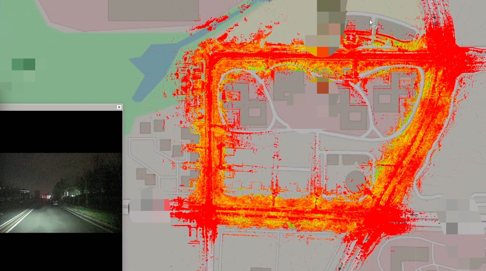
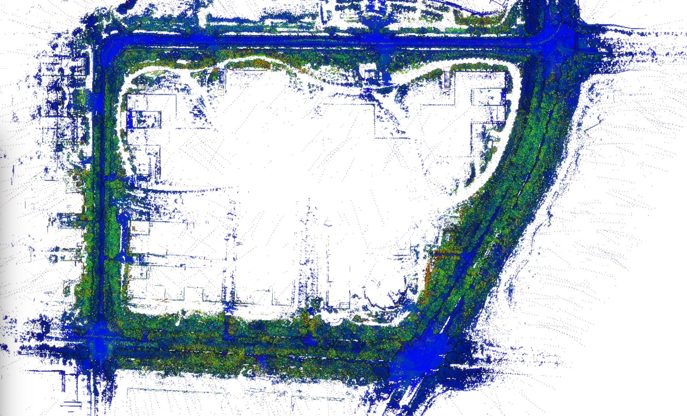
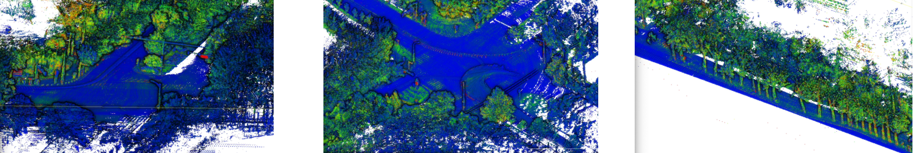

# FAST_LIO_GPS

## About FAST_LIO_GPS
this is a  modified version of  [FAST-LIO2](https://github.com/hku-mars/FAST_LIO) and [SC-PGO](https://github.com/gisbi-kim/SC-A-LOAM),  With the help of gps, We can  obtain map with UTM coordinate. So, using global map , Vehicle navigation can run in the world coordinate system

## Features
-  directly mapping in UTM Coordinate system

## How to use?
-  
    to be continue...

